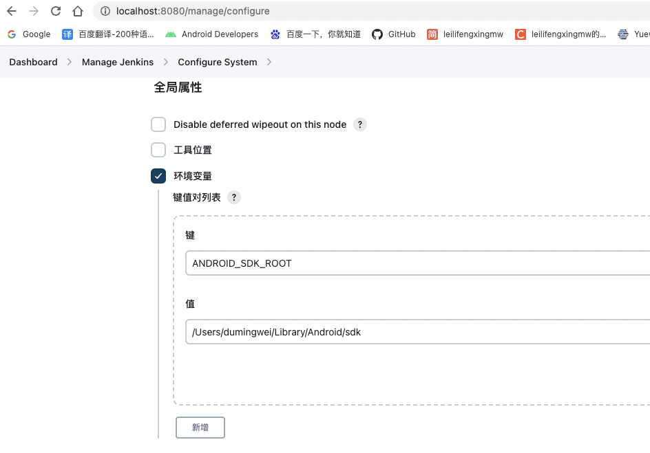

### Jenkins 安装
```shell script
brew install jenkins-lts
```

* 启动服务：brew services start jenkins-lts
* 重启服务：brew services restart jenkins-lts
* 停止服务：brew services stop jenkins-lts

### 使用的时候遇到的问题

```text
SDK location not found. Define location with an ANDROID_SDK_ROOT environment variable or by setting the sdk.dir path in your project's local properties file at '/Users/dumingwei/.jenkins/workspace/GradleDemo/local.properties'.
```

解决方法，需要设置 ANDROID_SDK_ROOT 这个全局变量 。




### 传递参数


传递的参数，可以通过在gradle.properties里面对应的名称来接收。


### 其他

* [macOS Installers for Jenkins LTS Homebrew Installer ](https://www.jenkins.io/download/lts/macos/)
* [Android Jenkins+Git+Gradle 持续集成 -- 实在太详细](https://juejin.cn/post/6844903457833353229)
* [Mac的Jenkins持续集成环境搭建](https://www.jianshu.com/p/96fa461c543b)
* [Mac下获取Homebrew安装的软件路径](https://juejin.cn/post/6844903561705291789)

