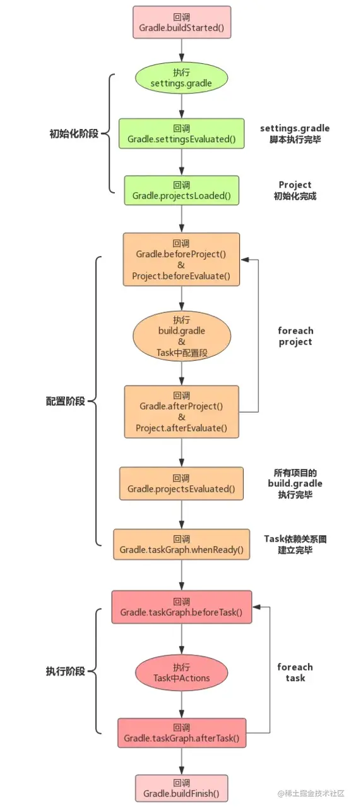

* CMD+K 强制清空终端内容并将偏移置0

### 关掉Charles Proxy后，Gradle 报错Connect to 127.0.0.1:8888 [/127.0.0.1] failed: Connection refused (Connection refused)

解决方法：pkill -f '.*GradleDaemon.*'

然后重启 Android Studio.

参考链接：

* [配置 build ](https://developer.android.com/studio/build?hl=zh-cn#groovy)

### 学习gradle

## gradle命令
1. gradlew -v 查看 版本信息
2. gradlew -h 查看帮助
3. gradlew build 检查依赖并编译打包

5. gradlew assembleDebug 编译debug版本

这将在`project_name/module_name/build/outputs/apk/`中输出APK。该文件已使用调试密钥进行签名并使用`zipalign`对齐，因此您可以立即将其安装到设备上。


4. gradlew assembleRelease 编译release版本


6. gradlew :app:dependencies --configuration implementation 查看 app implementation  了那些依赖


[从Gradle生命周期到自定义Task挂接到Build构建流程全解](https://juejin.cn/post/6982379643311489032#comment)

## Gradle 构建生命周期

参考链接[Gradle 之一安卓构建流程](https://juejin.cn/post/6987207432535539719)

注意：Gradle 执行脚本文件的时候会生成对应的实例，主要有如下三种对象：

1、Gradle 对象：在项目初始化时构建，全局单例存在，只有这一个对象

2、Project 对象：每一个 build.gradle 都会转换成一个 Project 对象

3、Settings 对象：Seetings.gradle 会转变成一个 Seetings 对象



* 初始化阶段
* 配置阶段
* 执行阶段

### 初始化阶段

监听初始化过程，在 setting.gradle 中监听

```groovy
//监听初始化过程
gradle.addBuildListener(new BuildListener() {

    @Override
    void buildStarted(Gradle gradle) {
        println("//开始构建")
    }

    @Override
    void settingsEvaluated(Settings settings) {
        println("//settings.gradle执行解析完毕,settings评估完成（settins.gradle中代码执行完毕）")
    }

    @Override
    void projectsLoaded(Gradle gradle) {
        println("//Project初始化构造完成,初始化阶段结束")
    }

    @Override
    void projectsEvaluated(Gradle gradle) {
        println("//所有Project的build.gradle执行解析完毕,配置阶段结束")

    }

    @Override
    void buildFinished(BuildResult result) {
        println("//构建结束")
    }
})
```

### 配置阶段

配置阶段的任务：是执行各项目下的build.gradle脚本，完成 Project 的配置，并且构造Task任务依赖关系图以便在执行阶段按照依赖关系执行Task。


Task 依赖关系配置完成监听

```groovy
gradle.getTaskGraph().whenReady {
    println "whenReady Task依赖关系构建完成，size=${it.allTasks.size()}"
    it.allTasks.forEach { task ->
        println "whenReady taskName: ${task.name} , taskPath: ${task.path}"
    }
}
```

### 执行阶段

指定 Task 执行顺序

在Gradle中，有三种方式指定task的执行顺序：

* dependsOn 强依赖方式

静态依赖：

```groovy
task taskX {
  doLast{
    println 'taskX'
  }
}

task taskY {
  doLast{
    println 'taskY'
  }
}

task taskZ(dependsOn:taskX) { // 多依赖方式：dependsOn:[taskX,taskY]
  doLast{
    println 'taskZ'
  }
}

// 当我们执行taskZ的时候，由于依赖了taskX，则taskX会先执行，然后才会执行：taskZ
```

```groovy
task taskZ {// 定义Task的时候不指定依赖
  doLast{
    println 'taskZ'
  }
}

// 通过task的dependsOn方法，也可以指定task的依赖task。
taskZ.dependsOn(taskX,taskY)

```

动态依赖：当 Task 在定义的时候，不知道所依赖的 Task 是什么，在配置阶段，通过条件找出符合条件的 Task ，并进行依赖。

```groovy
task lib1 {
  doLask{
    println 'lib1'
  }
}
task lib2 {
  doLask{
    println 'lib2'
  }
}
task lib3 {
  doLask{
    println 'lib3'
  }
}

// 动态指定taskX依赖所有以lib开头的task
task taskX{
  // 动态指定依赖
  dependsOn this.tasks.findAll{ task->
    return task.name.startsWidth('lib')
  }
  doLast {
    println 'taskZ'
  }
}
```

* 通过Task输入输出


* 通过API指定执行顺序


## ADB 命令 参考链接 http://yuanfentiank789.github.io/2016/09/01/adb/
1. adb devices 列出所有连接设备 或者使用 adb devices -l 
2. adb install app\build\outputs\apk\debug\hm-debug-1.0-huawei.apk 安装apk
3. adb uninstall [-k] <package> 卸载包名为package的应用('-k' 意味着保存数据和缓存目录)
4. adb keygen keyname.jsk 生成adb公钥和私钥。
5. adb help 查看帮助命令
6. adb shell 运行shell 命令
7. sqlite3 进入shell 以后使用 sqlite3 操作数据库
8. adb shell df 查看手机磁盘空间
9. adb shell getprop ro.build.version.release 获取手机系统版本
10. adb shell pm list packages -f 查看所有已安装应用的包名
11. adb push README.md /sdcard/test/README.md 
12. adb tcpip PORT               restart adb server listening on TCP on PORT
13. adb connect HOST[:PORT]      connect to a device via TCP/IP [default port=5555]
使用adb命令启动应用
```xml
adb shell 
am start -n 包名/要启动的activity的全路径名 例如
am start -n com.hm.retrofitrxjavademo/com.hm.retrofitrxjavademo.ui.activity.MainActivity
```
查看手机型号
```xml
adb shell getprop ro.product.model
```
查看分辨率
```xml
adb shell wm size
```

```
Physical size: 1080x1920
Override size: 2160x2200

```
修改屏幕分辨率
```
wm size 2160x2200
```

直接使用dp修改

```java
wm size360dpx640dp
```

修改完毕以后，也可以使用`adb shell reset`重置。


查看屏幕密度
```xml
adb shell wm density
```
显示屏参数
```xml
adb shell dumpsys window displays
```
查看Android 系统版本
```xml
adb shell getprop ro.build.version.release
```
截图,可以使用 adb shell screencap -h 查看 screencap 命令的帮助信息
```xml
adb shell screencap -p /sdcard/sc.png 
```
录屏 可以使用 adb shell screenrecord --help
```xml
adb shell screenrecord /sdcard/filename.mp4
```

输出系统崩溃的log：

系统应用 ——>

```
adb shell dumpsys dropbox system_app_crash --print > crash.txt

adb shell dumpsys dropbox system_app_anr --print > anr.txt
```

第三方应用 ——>

```
adb shell dumpsys dropbox data_app_crash --print > crash.txt

adb shell dumpsys dropbox data_app_anr --print > anr.txt
```

### jenkins打包

* [Mac 环境下 Android 使用Jenkins 构建自动化打包](https://blog.csdn.net/u011418943/article/details/108131146)


### AndResGuard

How to Launch

If you are using Android Studio, you can find the generate task option in andresguard group. Or alternatively, you run ./gradlew resguard[BuildType | Flavor] in your terminal. The format of task name is as same as assemble.

### 自定义插件

* [Android 自定义Gradle插件的3种方式](https://www.jianshu.com/p/f902b51e242b)  这篇文章写的最好。


### 查看依赖树的插件

[gradle-task-tree](https://github.com/dorongold/gradle-task-tree)

```
//这个插件用来查看task依赖树
classpath "com.dorongold.plugins:task-tree:2.1.0"
```


2. 使用命令 

`./gradlew build --scan`


### 调试插件

* [Android Studio调试Gradle插件](https://blog.csdn.net/ZYJWR/article/details/113129586)
./gradlew --no-daemon -Dorg.gradle.debug=true :app:assembleDebug
./gradlew --no-daemon -Dorg.gradle.debug=true :app:transformClassesWithLifeCycleTransformForDebug 


./gradlew --no-daemon -Dorg.gradle.debug=true :app:transformClassesWithSpiderStatisticsTransformForDebug

 

