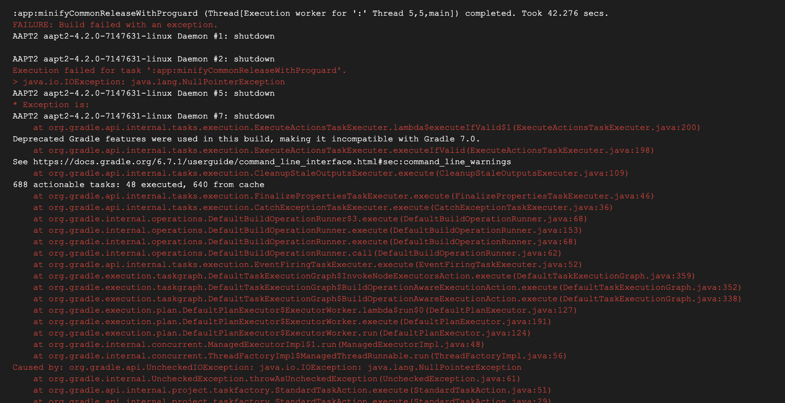

### 关闭R8导致混淆出问题。

```text
Execution failed for task ':app:minifyCommonReleaseWithProguard'.
> java.io.IOException: java.lang.NullPointerException
> java.io.IOException: Please correct the above warnings first.
```

会有类似的错误信息。



出现的原因：Kotlin使用的版本是 `1.6.10`（1.5.30版本以上应该都会有问题），然后再gradle.properties文件里面关闭了R8。

```text
android.enableR8=false
```

原因：感觉应该是高版本的Kotlin，必须使用R8来进行编译。解决方法，将 `android.enableR8=false` 改为 `android.enableR8=true`。

注意：当您使用 Android Studio 3.4 或 Android Gradle 插件 3.4.0 及更高版本时，R8 是默认编译器，用于将项目的 Java 字节码转换为在 Android 平台上运行的 DEX 格式。

### D8

* D8是一款用于取代 DX、更快的 Dex 编译器，可以生成更小的 APK;

### R8

R8之前采用D8+ProGuard的形式构建，R8则将ProGuard和D8工具进行整合，目的是加速构建时间和减少输出apk的大小；

开启与关闭

Android Studio 3.3 需在项目的 gradle.properties 里加上：android.enableR8=true
Android Studio 3.4 或 Android Gradle 插件 3.4.0 及更高版本时，R8 是默认编译器（不再使用 ProGuard 执行编译时代码优化），用于将项目的 Java 字节码转换为在 Android 平台上运行的 DEX 格式。


参考链接:

* [build apk --release crash. Execution failed for task ':app:minifyReleaseWithProguard'](https://github.com/flutter/flutter/issues/53409)
* [使用 R8 压缩您的应用](https://juejin.cn/post/6914497144346902542#heading-1)
* [缩减、混淆处理和优化应用](https://developer.android.google.cn/studio/build/shrink-code?hl=zh-cn) 这个文档有时间再看看。
* [Android D8 编译器 和 R8 工具](https://juejin.cn/post/6973089862278725640)
* [https://juejin.cn/post/7052636587288428557](https://juejin.cn/post/7052636587288428557)

maxSdkVersion 的问题。


### 在AndroidManifest.xml文件中，指定 maxSdkVersion 导致 权限无法获取到的问题。
